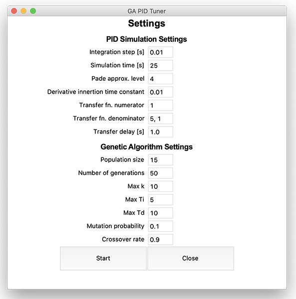
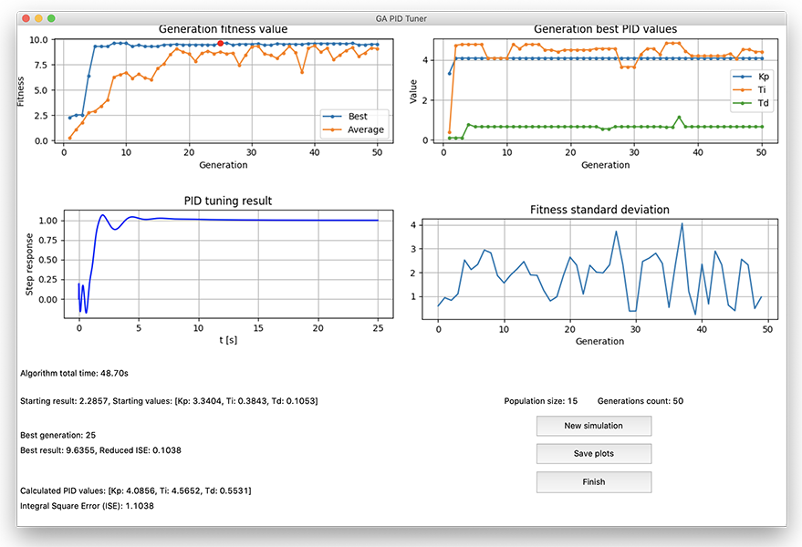

# GA PID Tuner

Genetic algorithm that optimizes PID values to minimize ISE.
It can use either Matlab/Simulink or built-in Python model
for simulating plant.






### Used dependencies
* Python 3.6+
* NumPy
* SciPy
* Control
* Matlotlib
* MATLAB Engine for Python
* TKInter

### Installation and startup

1. Install Python 3.6+
2. Clone this repo
3. Install dependencies:
```bash
pip install numpy scipy matplotlib control
```
4. Go into the repo directory and run `main.py`
```bash
cd GA_PID_Tuner && python main.py
```

##### (Optional) MATLAB Engine for Python installation
Described here: https://www.mathworks.com/help/matlab/matlab_external/install-the-matlab-engine-for-python.html

### Project structure

Opis większości plików i katalogów w projekcie:

- `genetic` - Genetic Algorithm reletated files
    - `algorithms` - **Crossover, mutation and selection implementations**
- `matlab` - Matlab and simulink files
    - `simulate.m` - _\[function]_ Simulates model with Simuling
    - `simulate2.m` - _\[function]_ Sumulates model *WITHOUT* Simulink
    - `circuit.slx` - Simulink model (Note: watch out the Simulation Parameters)
    - `run.m` - for testing purposes
- `sim` - model simulation and fitness calculation
    - `AbstractSimModel.py` - base class
    - `PythonSimulatedModel.py` - simulation in Python using _Control_ lib
    - `MatlabModel.py` - starts Matlab and runs `simulate2.m`
    - `MatlabSimulinkModel.py` - Starts Matlab and runs `simulate.m` + Simulink
- `tests` - unit tests
- **`main.py`** - run this file to start
- `config.py` - default config
- `application.py` - UI Interface

#### Enabling Matlab
By default, a Python built-in model is used for calculating fitness,
but there is also Matlab support. To switch model to matlab, do the
following:

0. Make sure that you have Matlab Engine for Python installed
1. Check the `matlab` directory to see how scripts are made
2. Open `application.py`
3. Add the beginning, add the proper import:
```python
from sim.MatlabModel import MatlabModel
# Or, if you want to use Simulink:
from sim.MatlabSimulinkModel import MatlabSimulinkModel
```
4. In line 289, change `PythonSimulatedModel(cfg)` to either
`MatlabModel(cfg)` or `MatlabSimulinkModel(cfg)`

```python
self.simulation = Simulation(cfg,
                            PythonSimulatedModel(cfg),
                            GeneticAlgorithmImpl(cfg))

```